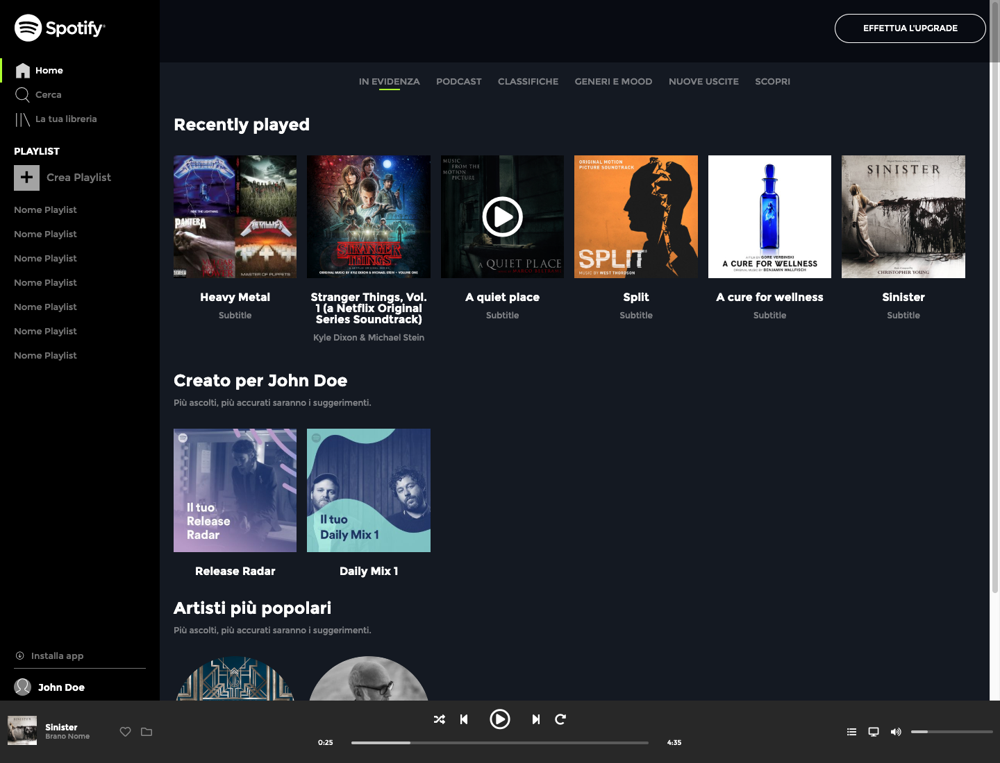
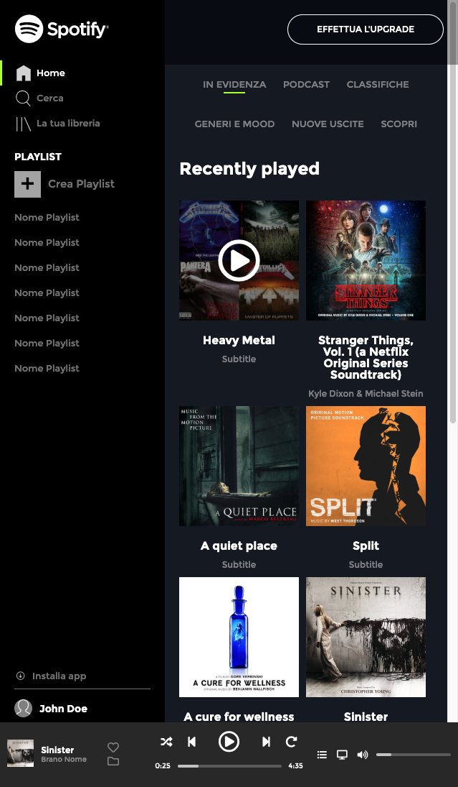

# 🎵 Esercizio: **Spotify Web – La nostra prima Web App!**  

🔹 **Obiettivo:**  
Riprodurre il layout di **Spotify Web**, tenendo presente che il **contenuto della pagina non dovrà mai uscire dalla viewport**, proprio come una vera **web app**.  

📸 In allegato troverete:  
- **Screenshot** per le diverse versioni **responsive**.  
- **Video di riferimento** per:  
  - **Hover effects**  
  - **Comportamento responsive**  
  - **Gestione della chiusura del browser in altezza**  

---

### Screenshots

## 📌 **Consigli per lo sviluppo**  

🛠 Questo esercizio si svolgerà **in più giorni**, quindi:  
✅ **Focalizzatevi sulle macroaree** prima di curare i dettagli.  
✅ **Le regole CSS** da utilizzare sono quelle viste fino ad ora.  
✅ **Semplificate!** Se una soluzione sembra troppo complicata, provate un'altra strada.  

🎯 **Passaggi consigliati:**  
1️⃣ Strutturare il layout principale.  
2️⃣ Testare il comportamento su diverse risoluzioni.  
3️⃣ Aggiungere gli **effetti hover** e gli **stili responsive**.  
4️⃣ Ottimizzare il codice e rifinire i dettagli.  

## Anteprima

[-> PREVIEW <-](https://simonelupone.github.io/html-css-spotifyweb/)